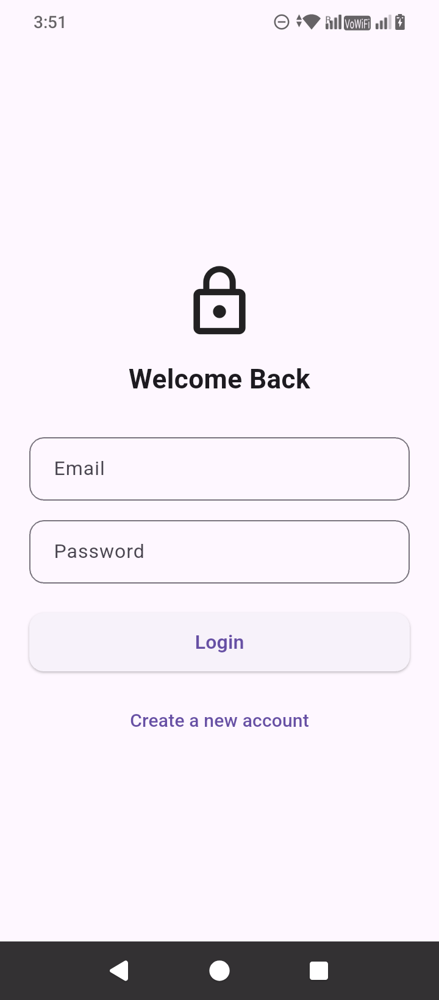
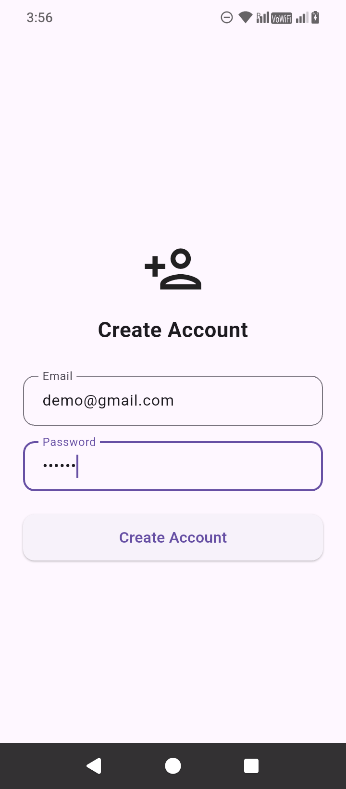
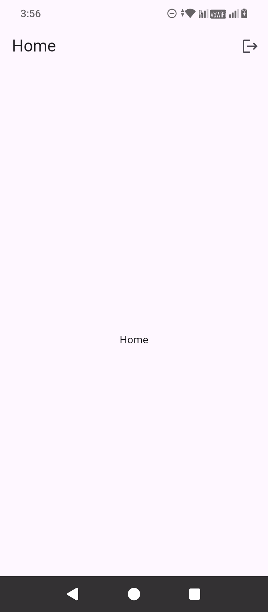

# 🔐 Flutter Firebase Authentication App

A clean and production-ready **Flutter authentication application** built using **Firebase Authentication** and **Riverpod**.  
This project implements a complete **Login → Signup → Home → Logout** flow with proper state management and error handling.

Built as part of my journey as an **MSc IT Project Management student** and aspiring **Mobile Application Developer** based in Berlin, Germany.

---

## 🚀 Features

### 🔑 Authentication
- User **Signup** using email & password  
- User **Login** with registered credentials  
- Secure **Logout** functionality  
- Automatic redirect based on authentication state  

### ⚠️ Error Handling & UX
- Clear error messages for:
  - Unregistered users
  - Wrong password
  - Invalid credentials
- Loading indicators for all async actions  
- Disabled buttons during processing  

### 🧠 State Management
- Auth state driven navigation  
- Clean separation of UI and business logic  
- Riverpod `StateNotifier`–based architecture  

---

## 🖼 Screenshots

### 📌 Login Screen


---

### 📌 Signup Screen


---

### 📌 Home Screen


---

## 🛠 Tech Stack

- **Flutter**
- **Dart**
- **Firebase Authentication**
- **Riverpod (StateNotifier)**
- **Material UI**

---

## 📁 Project Structure

```text
lib/
├── features/
│   └── auth/
│       ├── presentation/
│       │   ├── login_screen.dart
│       │   ├── signup_screen.dart
│       │   └── home_screen.dart
│       └── provider/
│           ├── login_provider.dart
│           ├── login_state.dart
│           └── auth_state_provider.dart
├── app.dart
├── main.dart
└── firebase_options.dart
🎯 What I Learned
Implementing real-world authentication flows in Flutter

Handling Firebase auth state correctly

Managing async state using Riverpod

Avoiding common auth pitfalls (auto-signup, stuck loading, logout issues)

Building clean, maintainable Flutter architecture

Debugging complex state-related issues

🔮 Future Improvements
Remember last logged-in email

Password visibility toggle

Dark mode support

go_router integration

Profile screen

Unit & widget tests

📬 Contact
Built by Dhruv
MSc IT Project Management
Berlin, Germany 🇩🇪

If you found this project helpful, feel free to ⭐ the repository!
